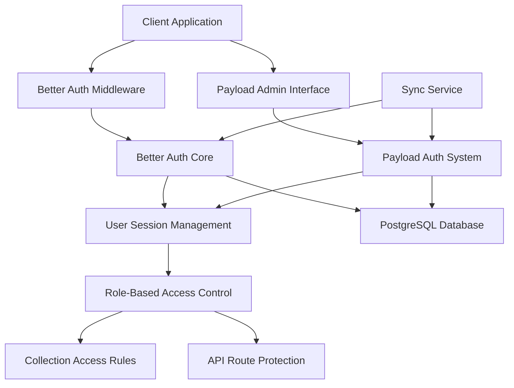
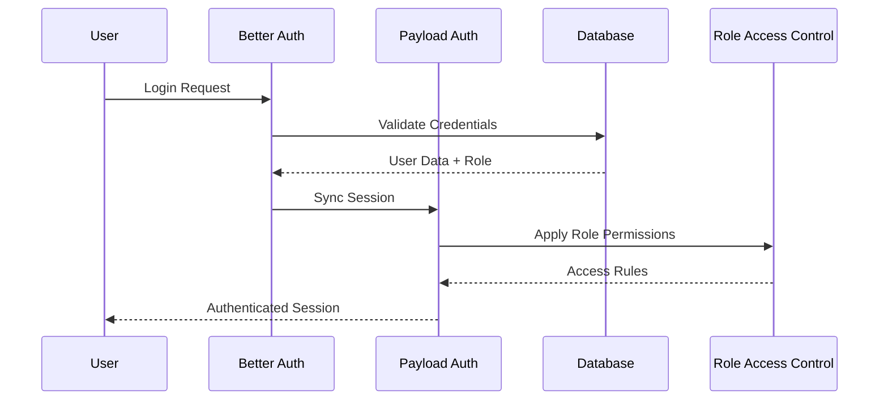

# Design Document

## Overview

This design integrates Better Auth with Payload Auth to create a unified authentication system supporting multiple user roles. The solution leverages the existing `@payload-auth/better-auth-plugin` while extending it to support custom role definitions and seamless synchronization between both authentication systems.

## Architecture

### High-Level Architecture



### Authentication Flow



## Components and Interfaces

### 1. Enhanced User Role System

**Role Definitions:**
```typescript
enum UserRole {
  SUPER_ADMIN = 'superAdmin',
  ADMIN = 'admin', 
  BUSINESS = 'business',
  HR = 'hr',
  CONTENT = 'content',
  USER = 'user'
}

interface RolePermissions {
  collections: {
    [collectionSlug: string]: {
      create: boolean;
      read: boolean | AccessFilter;
      update: boolean | AccessFilter;
      delete: boolean | AccessFilter;
    }
  };
  media: {
    read: boolean | MediaFilter;
    upload: boolean;
    delete: boolean;
  };
  admin: {
    access: boolean;
  };
}
```

### 2. Better Auth Configuration Enhancement

**Extended Better Auth Setup:**
```typescript
interface EnhancedBetterAuthConfig {
  user: {
    additionalFields: {
      role: {
        type: 'string';
        defaultValue: UserRole.USER;
        required: true;
      };
      firstName: {
        type: 'string';
        required: true;
      };
      lastName: {
        type: 'string';
        required: true;
      };
    };
  };
  plugins: [
    admin({
      roleField: 'role',
      allowedRoles: Object.values(UserRole)
    }),
    roleBasedAccess(),
    payloadSync()
  ];
}
```

### 3. Payload Auth Plugin Configuration

**Enhanced Plugin Configuration:**
```typescript
interface PayloadAuthPluginConfig {
  users: {
    allowedFields: ['name', 'firstName', 'lastName', 'role'];
    defaultRole: UserRole.USER;
    defaultAdminRole: UserRole.ADMIN;
    roleField: 'role';
    roleOptions: RoleOption[];
  };
  roleSync: {
    enabled: true;
    bidirectional: true;
  };
}
```

### 4. Synchronization Service

**Sync Service Interface:**
```typescript
interface SyncService {
  syncUserFromBetterAuth(userId: string): Promise<void>;
  syncUserFromPayload(userId: string): Promise<void>;
  syncRoleChange(userId: string, newRole: UserRole): Promise<void>;
  handleSyncFailure(error: SyncError): Promise<void>;
}
```

## Data Models

### Enhanced User Model

```typescript
interface User {
  id: string;
  email: string;
  emailVerified: boolean;
  name: string;
  firstName: string;
  lastName: string;
  role: UserRole;
  image?: string;
  banned?: boolean;
  banReason?: string;
  banExpires?: Date;
  createdAt: Date;
  updatedAt: Date;
  // Better Auth specific fields
  betterAuthId?: string;
  // Payload specific fields  
  payloadId?: number;
}
```

### Role Permission Matrix

| Role | Collections (CRUD) | Media Access | Admin Panel | API Access |
|------|-------------------|--------------|-------------|-------------|
| SuperAdmin | Full | All files | Full | Full |
| Admin | Create/Read/Update | All files | Full | Full |
| Business | Read only | Approved content | Limited | Read only |
| HR | Read/Update forms | PDFs only | Forms section | Forms API |
| Content | Create/Read/Update content | Images only | Content section | Content API |
| User | Read public | Public images | No access | Public API |

## Error Handling

### Authentication Errors
- **Invalid Credentials**: Return 401 with clear error message
- **Insufficient Permissions**: Return 403 with role requirements
- **Session Expired**: Return 401 and trigger re-authentication
- **Sync Failures**: Log error, attempt retry, fallback to last known state

### Sync Error Recovery
```typescript
interface SyncErrorHandler {
  retryPolicy: {
    maxRetries: 3;
    backoffStrategy: 'exponential';
    baseDelay: 1000;
  };
  fallbackStrategy: 'lastKnownGood' | 'defaultPermissions';
  alerting: {
    logLevel: 'error';
    notifyAdmins: boolean;
  };
}
```

## Testing Strategy

### Unit Tests
- Role permission validation
- User synchronization logic
- Access control functions
- JWT token validation
- Middleware functionality

### Integration Tests
- Better Auth + Payload Auth flow
- Cross-system session validation
- Role-based collection access
- Media access by role
- API endpoint protection

### End-to-End Tests
- Complete authentication flows
- Role assignment and updates
- Permission enforcement
- Session management
- Error scenarios and recovery

### Test Data Setup
```typescript
interface TestUserScenarios {
  superAdmin: TestUser;
  admin: TestUser;
  business: TestUser;
  hr: TestUser;
  content: TestUser;
  user: TestUser;
  unauthenticated: null;
}
```

## Security Considerations

### Session Security
- Secure cookie configuration
- CSRF protection
- Session timeout policies
- Concurrent session limits

### Role Validation
- Server-side role verification
- JWT signature validation
- Role escalation prevention
- Audit logging for role changes

### Data Protection
- Encrypted sensitive fields
- Role-based data filtering
- Secure API endpoints
- Input validation and sanitization

## Performance Optimizations

### Caching Strategy
- Role permissions caching
- Session data caching
- User profile caching
- Collection access rules caching

### Database Optimization
- Indexed role fields
- Optimized access control queries
- Connection pooling
- Query result caching

## Migration Strategy

### Phase 1: Setup Enhanced Configuration
- Update Better Auth configuration
- Enhance Payload Auth plugin setup
- Add role field to existing users

### Phase 2: Implement Synchronization
- Create sync service
- Add bidirectional sync hooks
- Test sync reliability

### Phase 3: Apply Access Controls
- Update collection access rules
- Implement media filtering
- Add API middleware

### Phase 4: Testing and Validation
- Comprehensive testing
- Performance validation
- Security audit
- User acceptance testing